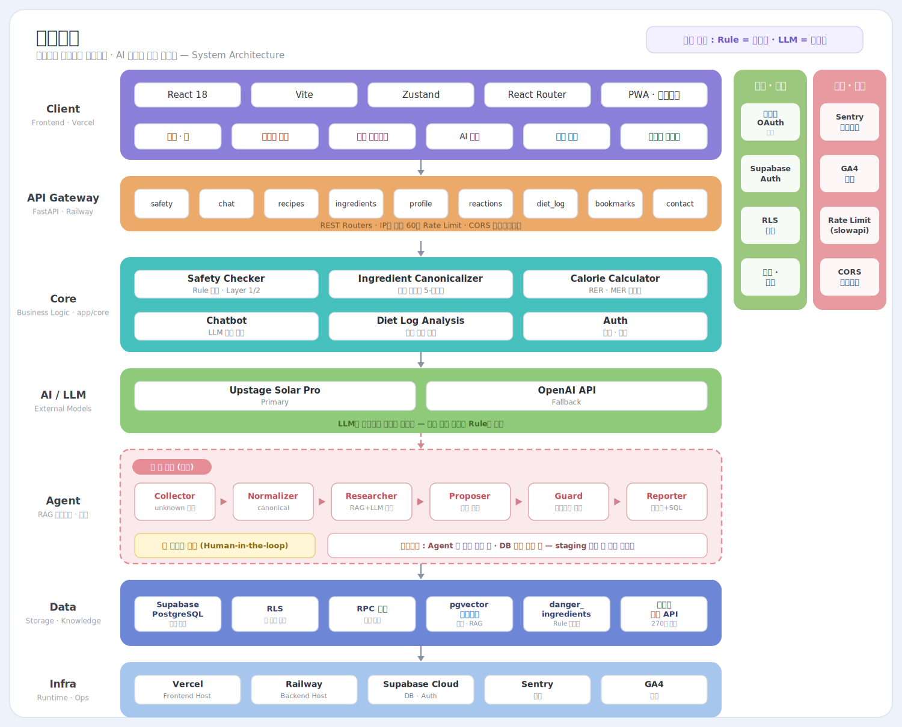
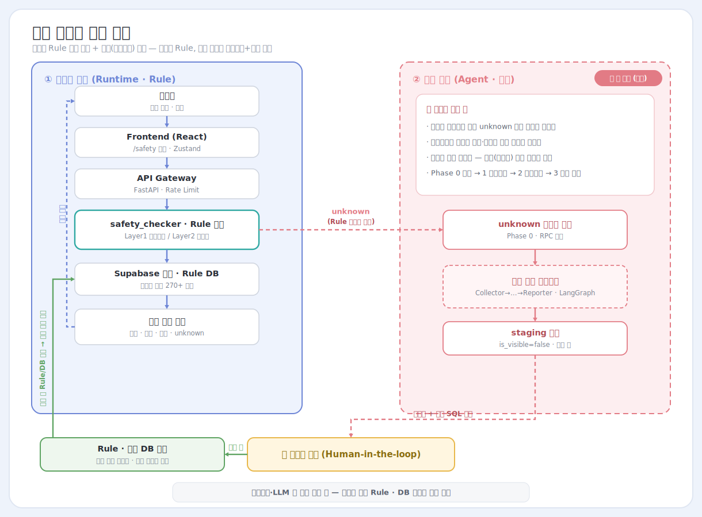

# 하루한끼 포트폴리오

반려견 식재료 안전성 확인, 간식 탐색, 급여 가이드 경험을 중심으로 설계한 서비스형 웹 프로젝트입니다.

- 배포 링크: [https://haru-meal.vercel.app/](https://haru-meal.vercel.app/)
- 진행 상태: React 기반 프론트엔드 핵심 사용자 플로우 구현 완료
- 공개 범위: 실제 운영용 private 저장소에서 민감 데이터와 내부 자산을 제외한 포트폴리오 공개 버전

## 프로젝트 개요

하루한끼는 반려견 보호자가 집에 있는 재료를 바탕으로 안전성을 확인하고, 급여 가능한 간식 아이디어와 급여 가이드를 자연스럽게 탐색할 수 있도록 설계한 프로젝트입니다.

이 공개 저장소는 포트폴리오 목적에 맞게 프론트엔드 사용자 경험, 화면 구조, 상태 관리 흐름, 데모 데이터 기반 인터랙션을 보여주는 데 초점을 두고 있습니다.

## 시스템 아키텍처

Client → API → Core → AI/LLM → Data → Infra로 이어지는 레이어 구조입니다. 안전성 판정은 Rule이, 설명은 LLM이 담당하도록 역할을 분리했으며, 점선으로 표시된 **Agent(재료 검수 에이전트)** 레이어는 곧 구현 예정인 부분입니다.



> Rule = 판정자 · LLM = 설명자 — 최종 안전성 판정은 항상 Rule이 담당하고, 에이전트는 조사·정리만 하며 DB 반영은 운영자 승인을 거칩니다.

### 재료 안전성 검증 흐름

핵심 기능인 재료 안전성 검증은 두 개의 루프로 나뉩니다. **실시간 판정 루프**는 사용자가 겪는 경로로, 판정을 100% Rule이 담당합니다. Rule에 없는 재료(`unknown`)가 나오면 그 신호가 **성장 루프(에이전트, 구현 예정)** 로 넘어가 조사·정리되고, 운영자 승인을 거쳐 Rule/재료 DB에 반영되어 다음 판정 범위가 넓어집니다.



> 에이전트와 LLM은 안전 판정에 관여하지 않습니다. 판정은 항상 Rule, DB 반영은 사람 승인을 거칩니다.

## 현재까지 구현한 범위

- 재료 기반 안전성 확인 UX
- 레시피 탐색, 북마크, 상세 보기 흐름
- 급여 가이드 및 상담형 인터페이스
- 프로필, 급여 기록, 설정 등 주요 화면 구조
- 모바일 우선 UI와 PWA 기반 프론트엔드 구성

## 데이터 정제 및 구조화

이 프로젝트에서는 반려견 급여 판단과 재료 탐색 경험의 정확도를 높이기 위해, 공공 원료 데이터와 서비스 내부 재료 표현을 서비스에 맞는 형태로 정리하는 작업도 함께 진행했습니다.

- 중복되거나 표현이 다른 재료명을 공통 이름 기준으로 정규화
- 띄어쓰기, 별칭, 카테고리 차이처럼 사용자 입력에서 자주 생기는 변형을 흡수하도록 구조화
- 검색, 안전 배지, 레시피 연결에서 같은 재료가 일관되게 동작하도록 데이터 형태를 정리
- Rule 기반 안전성 판정 흐름에 맞게 재료 정보를 서비스에서 바로 사용할 수 있는 구조로 가공

실제 운영 데이터셋, 상세 정제 규칙, 내부 파이프라인 스크립트는 private 저장소에서 관리하고 있으며, 이 공개 저장소에는 포트폴리오 확인에 필요한 범위만 반영했습니다.

## 어디까지 진행됐는지

- React + Vite 기반 프론트엔드 전환 진행
- 핵심 사용자 여정 화면 구현 및 연결 완료
- 상태 관리와 API 연동 구조 정리
- 포트폴리오용 공개 저장소 분리 완료

현재 공개 저장소에서는 실제 서비스 운영에 사용되는 데이터셋, 데이터 생성 파이프라인, DB 마이그레이션, 내부 운영 문서는 제외되어 있습니다.

## AI · 에이전트 활용 방식

- Codex, Claude 계열 에이전트를 활용해 UI 구조 정리, 컴포넌트 분리, 반복 작업 보조, 문서화 작업을 진행했습니다.
- 다만 제품 방향, 정보 구조, UX 우선순위, 공개 범위 판단은 직접 설계하고 조정했습니다.
- 안전성 판단 자체는 LLM이 아니라 Rule 기반으로 분리하고, LLM은 설명 보조 역할로 활용하는 방향을 기준으로 설계했습니다.

## 앞으로의 방향성

- 개인화 급여 기록과 리포트 경험 강화
- 인증 및 보안 구조 고도화
- Rule 기반 안전성 판정과 설명형 AI의 역할 분리 강화
- 실제 서비스 운영 환경 기준의 데이터 흐름과 API 안정화

## 기술 스택

- React
- Vite
- React Router
- Supabase
- Vercel

## 로컬 실행

```bash
npm install
npm run dev
```

백엔드 또는 외부 연동용 환경 변수가 없더라도, 포트폴리오 확인이 가능하도록 일부 흐름은 데모 데이터 기반으로 동작합니다.

## 환경 변수

`.env.example`를 참고해 `.env.local`을 만들면 됩니다.

예시:

```bash
VITE_API_URL=http://localhost:8000
VITE_SUPABASE_URL=https://your-project.supabase.co
VITE_SUPABASE_ANON_KEY=your_public_anon_key
VITE_GA_MEASUREMENT_ID=G-XXXXXXXXXX
VITE_SENTRY_DSN=
```

## 공개 저장소에서 제외한 항목

- 실제 데이터셋
- 데이터 정제 및 생성 파이프라인
- DB 스키마와 마이그레이션
- 내부 운영 문서
- 서비스 운영용 비밀키와 환경변수
- 비공개 비즈니스 자산 및 내부 룰 자산

## 안내

이 저장소는 실제 운영 저장소 전체를 그대로 공개한 것이 아니라, 포트폴리오 공개를 위해 안전하게 분리한 버전입니다.
